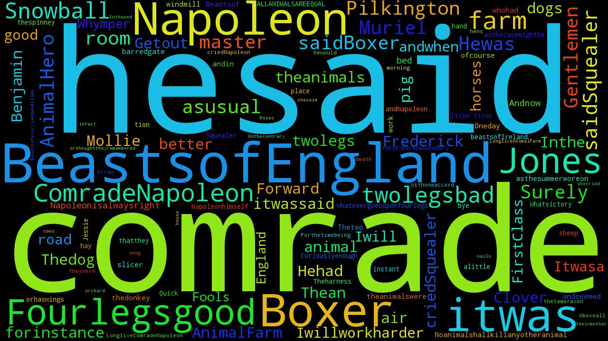
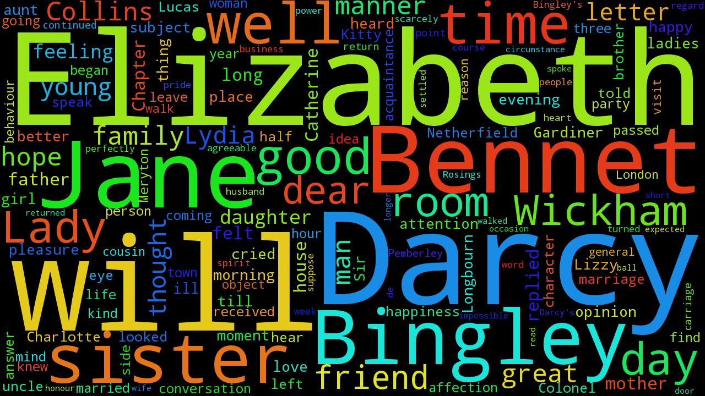

### Creates a Word Cloud from a given pdf

Simply add a the name of the pdf in main.py and provide the starting page & end page and get a word cloud

Here are some examples

Indian Constitution
------

*The pdf of Indian Constitution was downloaded from the* [website](http://indiacode.nic.in/coiweb/welcome.html) *of  Ministry of Law and Justice (Legislative Department).*

Animal Farm by George Orwell
------

Pride and Prejudice by Jane Austen
------

*Animal farm and Pride & Prejudice were downloaded from the website of* [Project Gutenberg](https://www.gutenberg.org/)
